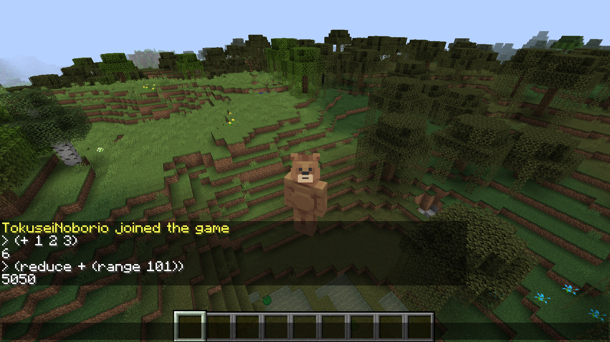

# HaLaCraft

Modding Minecraft with Clojure




At the in-game prompt, you can execute the code of Clojure.

```
/clj (range 10)
/clj (+ 1 2 3)
```

## Installation

Follow these steps to download and install SpigotMC.

1. Download Spigot's [BuildTools.jar][spigotdl] 

2. Save the BuildTools.jar file to a new directory called spigotmc.

3. Open a terminal (Mac and Linux) or command prompt (windows) window and type `java -jar BuildTools.jar`. This will kick off a long series of commands to "build" SpigotMC.

4. When the build is done, there will be a new file beginning with `spigot` and ending in `.jar` in the spigotmc directory. Run this file by typing `java -jar spigot-1.15.2-R0.1-SNAPSHOT.jar` (it might not be that exact name - you can list files in the directory by typing `dir` (Windows) or `ls` (Mac and Linux).
5. The server will start up then shut down very shortly afterwards. You'll need to edit a file called `eula.txt` - change `eula=false` to `eula=true` and save the file.
6. Run the `java -jar spigot-1.15.2-R0.1-SNAPSHOT.jar nogui` command again - this time the server will start up. Shut it down by typing `stop` at the server prompt.

7. Download the halacraft.jar plugin and save it to the plugins directory and restart the server by typing `java -jar spigot-1.15.2-R0.1-SNAPSHOT.jar nogui`.

## License

Copyright © 2020 [Nyampass Co., Ltd.](https://nyampass.com/)

This program and the accompanying materials are made available under the
terms of the Eclipse Public License 2.0 which is available at
http://www.eclipse.org/legal/epl-2.0.

This Source Code may also be made available under the following Secondary
Licenses when the conditions for such availability set forth in the Eclipse
Public License, v. 2.0 are satisfied: GNU General Public License as published by
the Free Software Foundation, either version 2 of the License, or (at your
option) any later version, with the GNU Classpath Exception which is available
at https://www.gnu.org/software/classpath/license.html.

[api]: https://hub.spigotmc.org/javadocs/spigot/
[spigotdl]: https://hub.spigotmc.org/jenkins/job/BuildTools/lastSuccessfulBuild/artifact/target/BuildTools.jar
[spigotapi]: https://hub.spigotmc.org/javadocs/spigot/